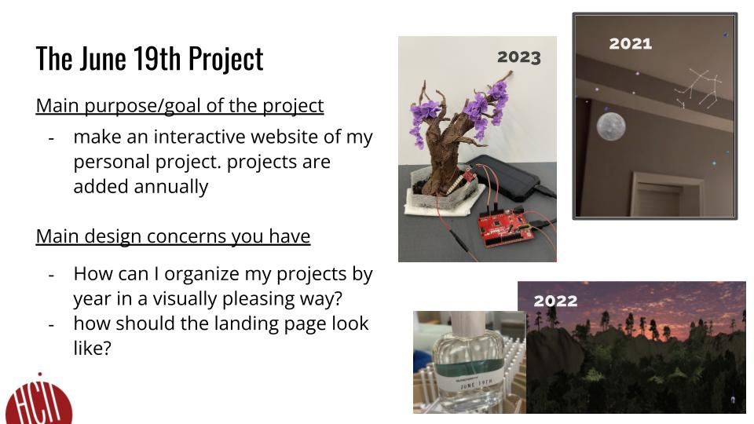
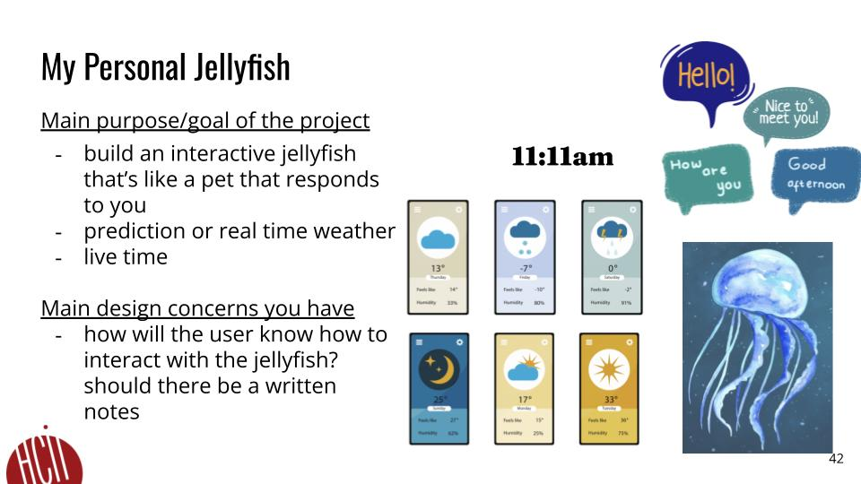
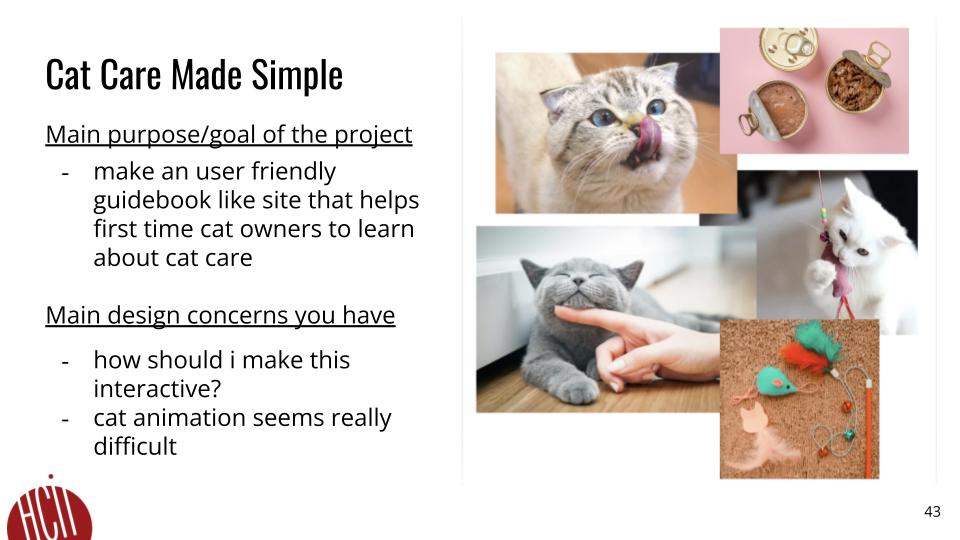

# **FP2 Evaluation of the Final project**

## Project Description

Briefly restate your motivation and a short description of your project.

This project, titled "My Personal Jellyfish," is a website designed to feature an interactive jellyfish that acts as a virtual pet. The jellyfish responds to user interactions and provides real-time information, including weather predictions and live time. The goal is to create a responsive, engaging experience where users can communicate with the jellyfish. Some design considerations include ensuring users understand how to interact with the jellyfish, possibly through written notes or guidance. Features illustrated include weather icons, time display, and conversational speech bubbles from the jellyfish.

## High-Fi Prototypes

### *Prototype 1*

 

 

My first prototype design features a chat-based interaction within an open ocean environment. Users can initiate conversations with the jellyfish, asking questions like “How was your day?” or requesting weather updates. The jellyfish responds with relevant information, such as upcoming weather for a specified location. This design focuses on creating a conversational, engaging experience that allows users to explore and interact with the jellyfish in a playful, immersive setting.

### *Prototype 2*

 

My sedond prototype design features an action-based interaction within an environment resembling a view through a submarine window. Users can select specific actions, like asking for the weather, waving, or having the jellyfish follow their movements. The weather is displayed graphically, showing forecasts for the next few days. Additionally, the jellyfish follows the cursor when the user moves in a certain way, enhancing the sense of playful engagement. This design focuses on creating a more immersive experience, allowing users to interact with the jellyfish in a structured, visual, and engaging way.
…

## Usability Test

Discuss the user feedback you got during the evaluation / usability test (\~300 words). Indicate which feedback you implemented, inspired new directions, or otherwise influenced your final design. 

During the usability test using a "Think Aloud" approach in Figma, I received valuable feedback. Users suggested adding more UI elements for smoother interactions and recommended buttons for easier navigation. They also inquired about the possibility of using keyboard shortcuts, the source and display of weather information, and ways to initiate chats with the jellyfish. Additionally, they recommended using icons instead of text for a more visually intuitive design.

In response, I implemented several revisions based on this feedback. I developed new interaction designs and added navigation buttons to enhance usability. I also integrated the Weather API and GPT API to provide real-time weather information and conversational capabilities with the jellyfish, directly addressing user concerns. This feedback not only improved the functionality but also inspired me to create a more interactive, user-friendly final design.

## Updated Designs

Show screenshots of your updated design based on the user feedback (\<100 words, \~2 images).

I updated the project by adding dynamic elements based on the time of day. The background now changes color and light intensity, reflecting different times, such as morning, afternoon, and night. Additionally, the number of fish passing by varies each hour, adding a sense of cuteness and interactivity. These updates create a more immersive and engaging underwater experience, making the jellyfish environment feel lively and responsive to real-time changes. 

## Feedback Summary

Summarize the feedback you received in the lab session and discuss how it influenced your design (\~300 words). 

	The design features an interactive jellyfish on a website, offering action-based interactions. Users can select options like "Wave," "Weather," or "Show Me Around" to engage with the jellyfish. The interface includes a clock and date display, enhancing functionality. When users inquire about the weather, the jellyfish provides graphical updates, displaying forecasts for different dates and locations. Additionally, the jellyfish follows the user's cursor movements within the oval submarine view, creating a dynamic interaction. This design emphasizes playfulness while integrating practical features like time and weather updates.

## Milestones

Outline weekly milestones to plan your expected implementation progress until the end of the semester (\~300 words). 

For this project, I plan to use several JavaScript libraries and APIs to create a dynamic and interactive experience. p5.js will handle creative visuals and animations, including controlling background changes based on time, making the underwater environment feel immersive. I'll integrate the GPT API to enable conversational interactions with the jellyfish, adding a layer of personality and responsiveness. Day.js will manage time-based updates, such as adjusting the background color and changing the number of fish passing by each hour. Finally, the Fetch API will allow me to pull in real-time weather data, enhancing the realism by adding contextually relevant weather information to the environment. Together, these components will bring the jellyfish to life as a responsive, engaging virtual pet.

### *Implementation Plan*

- [ ] Week 9 Oct 28 \- Nov 1:
  - [x] FP1 due
  
- [ ] Week 10 Nov 4 \- Nov 8:   
  - [x] FP2 due

  Learn p5.js:
    Study p5.js basics, especially for handling animations and background changes.

    Implement a simple background color change based on a set time interval to test your understanding.

  Explore Day.js:
    Learn how to retrieve and manipulate time-based data.
    
    Practice implementing a function that changes the background based on the real-world time.

  Set up API Access:
    Familiarize yourself with Fetch API to retrieve external data (e.g., real-time weather).

    Explore GPT API documentation to understand conversational setup.

    Test basic calls to the Weather API and GPT API to verify data retrieval.

  Project Structure:
    Set up the project’s file structure with HTML, CSS, and JavaScript.

    Draft initial layout in HTML and CSS, adding placeholders for interactive elements like the jellyfish, weather, and time displays.

- [ ] Week 11 Nov 11 \- Nov 15:  
Dynamic Background:
  Use Day.js to trigger background color changes based on morning, afternoon, and evening time intervals.

  Integrate p5.js for smooth transitions and color shifts.

Weather API Integration:
  Use Fetch API to pull real-time weather data.

  Display weather data in the jellyfish’s speech bubble.

  Ensure the display updates based on new data fetched periodically (e.g., every hour).

Basic Jellyfish Interactions:
  Add basic animations to make the jellyfish wiggle or pulse to give it a “life-like” appearance.

  Implement simple mouse tracking to make the jellyfish follow the cursor, using p5.js for smooth, playful movement.

Initial Testing:
  Test interactions to ensure smooth transitions and responses, especially for background changes and weather data updates.

  Document any issues or areas needing improvement for week 3 adjustments.

- [ ] Week 12 Nov 18 \- Nov 22:   

Jellyfish GPT API Integration:
  Use GPT API to enable chat with the jellyfish.
  
  Create a chat box or bubble for user input and jellyfish responses.

  Set up sample conversational prompts (e.g., greetings, weather inquiries).

Icon and UI Enhancements:
  Replace text with icons for a more intuitive UI, as per user feedback.

  Add buttons for navigation (e.g., weather, chat, play) to make interactions smoother.

  Implement keyboard shortcuts for key actions, like opening chat or fetching weather data.

Conduct Usability Testing:
  Use Figma to conduct a Think Aloud test with a small group of users.

  Assign tasks like navigating the site, chatting with the jellyfish, and checking the weather.

  Collect feedback on UI clarity, responsiveness, and overall engagement.

Evaluate Feedback:
  Review and categorize feedback based on severity and feasibility of changes.

  Plan necessary revisions for the final week to address major usability issues.

- [ ] Week 13 Nov 25 \- Nov 29:  

UI and Interaction Refinements:
  Based on feedback, polish the jellyfish’s movement to make it feel more natural and responsive.

  Add more background assets (e.g., fish) to enhance the “submarine view.”

  Polish the responsiveness and styling of navigation buttons and icons.

Final API and Chat Improvements:
  Refine GPT API conversation flow to make responses feel more personalized and relevant.

  Test the weather display for accuracy and ensure it updates correctly in real-time.

Bug Fixes and Performance Optimization:
  Test on different devices and browsers to ensure compatibility.

  Resolve any bugs identified during testing, particularly with animations and data loading.

Final User Testing and Documentation:
  Conduct a final round of user testing to verify that all interactions are smooth and intuitive.

  Document the final version, noting any technical challenges, implementation details, and future improvement ideas.

- [ ] Week 14 Dec 2 \- Dec 6:  
  - [!] FP4 due 

### *Libraries and Other Components*

List the JS libraries and other components (if applicable) that you plan to use. 

p5.js 
Day.js
Fetch API 
GPT API 

## Generative AI Use Plan

Outline how you plan to use Generative AI tools to aid in the implementation (\~300 words).

I plan to use ChatGPT and Perplexity as resources to learn how to effectively implement JavaScript libraries and APIs for my project. I’ll rely on them to explain concepts clearly and guide me through the correct steps for programming dynamic interactions. Specifically, I want to understand how to create effects like changing background colors based on real-life time, displaying weather predictions, and making the jellyfish follow the cursor for added playfulness. My goal is to grasp the technical details of working with libraries like p5.js, Day.js, and the Fetch API to bring these interactions to life. By using ChatGPT and Perplexity, I hope to get detailed explanations, troubleshooting advice, and best practices for each element, ensuring I understand how to build an engaging, responsive user experience from scratch. This approach will help me break down complex tasks into manageable steps and implement the features I envision confidently and accurately.

### *Tool Use*

 What would you use? Edit the list given your plan. For each tool, explain briefly on what do you expect Generative AI to help you with and what might it not be able to help you with.

p5.js – For creative visuals, animations, and controlling background changes based on time, as well as smooth movements like jellyfish animations and cursor-following.

Day.js – To manage time-based updates, such as changing background colors depending on real-life time (morning, afternoon, evening).

Fetch API – For pulling in real-time weather data, allowing the display of up-to-date weather information as part of the interactive elements.

GPT API – To enable conversational interactions with the jellyfish, allowing users to chat with it and receive responses based on specific prompts.

### *Responsible Use*

How would you use Generative AI responsibly? 

Clearly inform users that the jellyfish’s responses are powered by an AI model (GPT API). If users provide personal or location-based information, ask for their consent explicitly, explaining how this data will be used. Will avoid collecting or storing sensitive user data, especially if your project doesn’t require it. Use real-time data like weather information without saving personal information. Configure the AI settings, if possible, to minimize the chance of generating inappropriate, misleading, or biased responses.Design AI interactions that encourage curiosity and play rather than serious, realistic conversations. This helps manage expectations and keeps the project light-hearted and playful engagements. 

# **FP1 \- Proposal for Critique**

## Idea Sketches

### *Idea 1*

"Personal Project Portfolio" is a personal project website where I showcase one project every year. I want to document and showcase my projects and and how my skills developed over time. I plan to make the design interactive by allowing users to click through different years to see individual projects, each with visuals, descriptions, and technical implementations. To keep it accessible, I’ll ensure high contrast for readability, use accessible fonts, and add descriptive tags to all media for screen readers. I want to convey a sense of development, showing both the successes and challenges of each project to give viewers a well-rounded understanding of my creative and technical skills.

### *Idea 2* 

"Your Personal Jellyfish" is an interactive website where a virtual pet jellyfish responds to user interactions while displaying live weather and temperature updates. My main focus for engagement is to give the jellyfish character-like qualities—users can tap to get its attention, and it will react by "waving" or moving closer to greet them. To make this accessible, I’ll include screen reader-compatible text for all animations, provide a toggle for simplified visuals, and use a color palette that’s easy on the eyes. Through this design, I want users to feel like the jellyfish is a friendly companion that brings the weather to life in a fun and interactive way.

…

### *Idea 3*

"Cat Care Made Simple" is an informational site for first-time cat owners, providing them with essential tips and guides on caring for their new pet. I’ll make the site interactive by organizing content into categories like "Nutrition," "Health," and "Behavior," and tips about emergency care based on personal experience and research. For accessibility, I plan to use a simple layout with large fonts, high-contrast colors, and alternative text for images, so all users can easily navigate and learn. My goal is to include practical information that reassures new cat owners and helps them feel confident in taking care of their new cat. 

…

## Feedback Summary

Summarize all the critiques you received during the lab session (\~300 words).

In my final project design process, I presented three ideas: the "Personal Project Portfolio," a site where I update one project per year; "Your Personal Jellyfish," an interactive site where a pet jellyfish shares things such as weather & temperature and interacts in different ways; and "Cat Care Made Simple," an informational website for first-time cat owners. 

Most of the feedback I got was focused on the first two ideas. For the "Personal Project Portfolio," people were curious about how I plan to organize the projects by year. They asked if I had plans for structure to highlight my progression and whether this format would help the user see my growth over time. I think having a solid organization could really help to present the projects, especially for people who want to see a steady development in my work and wonder about future projects. 

For "Your Personal Jellyfish," feedback leaned more toward the technical and interactive aspects. I got some questions about how the jellyfish would live within a weather application and what my plans are for using an API to display live weather data. I was also offered some creative ideas, like having the jellyfish respond to taps or come close to say "hello." I feel like these details could make the jellyfish feel more like a companion, adding a layer of playfulness and making it more engaging for users.

## Feedback Digestion

Digest the feedback you got in the lab (\~300 words). Indicate which critique you will act on in your next design and why you chose to incorporate/dismiss pieces of critique.

This feedback gave me ideas to consider and focus on, from structuring my portfolio for easy navigation and planning specific, interactive features for my final project. Because I had more ideas on what behaviors for the jellyfish project, I think I'll move forward with that idea. I'll be focusing on responsive interactions like the jellyfish reacting to hovers, clicks, or waving back to say hi. I want to keep ideating and developing interaction designs to build a unique, engaging experience with amazing visuals. 

