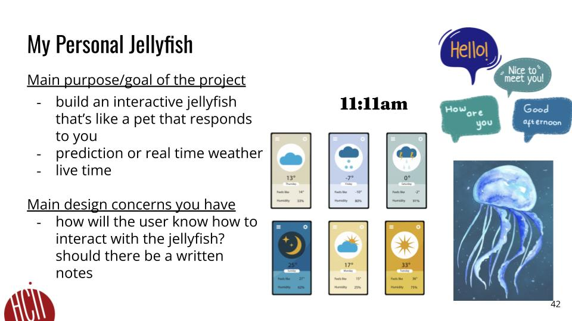
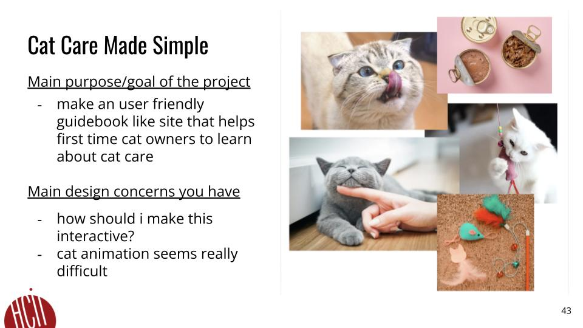

# **FP4 \- Final Project Writeup**

## Part 1: Website Description

My Personal Jellyfish  is an interactive website designed to bring a virtual jellyfish companion to life. Its goal is to create a fun and engaging experience where users can connect with a friendly jellyfish character. Through a chat interface, users can send messages to the jellyfish and receive thoughtful responses, making the interaction feel like a real conversation. To add a playful touch, the jellyfish also follows the user’s cursor movements, giving it a lifelike and interactive quality, as well as a live clock that displays the current time, enhancing the sense of connection and real-time engagement.

This website is perfect for anyone who loves aquatic life, enjoys creative technology, or appreciates charming character design. The calming, mesmerizing jellyfish aesthetic combined with the playful interactivity makes it especially appealing. It’s also great for those seeking a unique digital companion or a soothing, low-pressure way to unwind, offering a relaxing and memorable experience. It’s not just about observing—it’s about connecting, making it a comforting and fun escape from everyday life.

## Part 2: User Interaction

On the My Personal Jellyfish website, users can enjoy a variety of interactive features that bring their virtual jellyfish companion to life. The primary way to engage is through the chat interface, where users can type messages into a text box and press “Enter” or click the “Send” button to initiate a conversation. The jellyfish responds to these messages, creating a dynamic and personalized interaction. Another playful feature is cursor tracking, where the jellyfish’s gaze follows the user’s mouse movements across the screen. This adds a fun, lifelike quality to the experience, making the jellyfish feel responsive and engaged. Additionally, a live clock is displayed prominently on the page, showing the current time in real-time. This feature doesn’t require any interaction but enhances the immersive experience by grounding it in the present moment. Together, these interactions—chatting, cursor tracking, and the real-time clock—make the website a unique and captivating space for users to connect with their digital jellyfish friend. The simple yet creative design encourages users to explore and enjoy the calming, interactive environment.

## Part 3: External Tool

p5.js

p5.js is great for creative visuals and animations, and offers intuitive tools for interactive design. Its simplicity and flexibility made it a great fit for creating dynamic effects like cursor-following and smooth animations.
 I used p5.js to animate the jellyfish, create smooth cursor-tracking behavior. It also enabled seamless integration of visual and interactive elements.
p5.js helps me to build quality user experience with visually engaging animations and responsive interactions, making the jellyfish feel lifelike and immersive.

GPT API

The GPT API provides advanced conversational capabilities, allowing natural and context-aware responses. Its accuracy and adaptability made it the best option for creating engaging dialogue with the jellyfish.
 I implemented the GPT API to handle user inputs in the chat interface, generating realistic and meaningful responses from the jellyfish based on specific prompts.
The GPT API adds depth and interactivity by enabling a dynamic conversation with the jellyfish, making the experience feel more personal and engaging.

## Part 4: Design Iteration

Throughout the development, I made several key changes to enhance functionality and user experience. Initially, the jellyfish interaction was limited to basic animations, but I added cursor tracking to make the jellyfish more responsive and lifelike. The chat feature also evolved from static responses to using the GPT API, enabling dynamic and personalized conversations based on user input. This change was inspired by feedback suggesting users would prefer more meaningful interactions. 
I also introduced a live clock to create a stronger connection to real-world cues. These updates helped make the website feel more interactive and immersive. Each iteration aimed to refine the user experience, ultimately transforming the prototype into an engaging, polished final product.

## Part 5: Implementation Challenge

One major challenge was integrating the GPT API for the chat feature, as it required careful handling of asynchronous requests to ensure smooth and timely responses. This involved understanding how to manage API calls efficiently without disrupting the user experience. I had to implement error handling to account for scenarios where the API might lag or fail, ensuring the chat feature remained functional and user-friendly. 

## Part 6: Generative AI Use and Reflection

I used ChatGPT throughout the project to assist with brainstorming, coding, and content generation. It helped me refine ideas for the jellyfish interaction, debug code, and write clear descriptions for my project’s features and interactions.

### Usage Reflection

> Impact on your design and plan 
* It matched my expectations and plan in [FP2](#generative-ai-use-plan) in that p5.js successfully handled animations and cursor tracking for the jellyfish, creating smooth, playful movements as I planned. GPT API enabled the chat functionality I envisioned, allowing users to interact naturally with the jellyfish.

* It did not match my expectations and plan in [FP2](#generative-ai-use-plan) in that I initially expected Day.js to seamlessly manage background changes based on the time of day, but I encountered challenges in dynamically linking the time data to visual elements in real-time without delays or inconsistencies. Achieving smooth transitions required additional debugging and testing. Similarly, while I planned to use the Fetch API to easily retrieve real-time weather data, I faced issues with API rate limits and formatting the data into a user-friendly display. Integrating the weather data into the jellyfish’s speech bubble proved more complex than anticipated, requiring significant customization to align with the interactive design.

* GenAI tool did not influence my final design and implementation plan because I came up with the orignal idea of chatting with a jellyfish. It's my best friend's favortie animal and I wanted to make something cute and enjoyable for her. I only used chatGPT to get assistance for programming issues. 

> Use patterns
I accepted the AI-generated suggestions when they guided me in learning how to implement APIs for the project and provided valuable programming advice and troubleshooting assistance. For example, ChatGPT helped me understand the setup and usage of the Fetch API for retrieving real-time weather data, offering clear explanations and practical code examples. It also provided insights into handling asynchronous programming, which ensured smoother integration of API calls and improved the reliability of data retrieval. Additionally, it suggested solutions for common errors, such as handling rate limits and parsing JSON responses, which were critical to making the weather feature functional and user-friendly. These generations not only saved time but also enhanced my understanding of API integration and JavaScript programming. 

* I critiqued/evaluated the generated suggestions by … For example, 
  ChatGPT: This tool once suggested a complex implementation for managing background changes using multiple conditional statements. I modified this approach to use a simpler, time-based function with Day.js to make the code more efficient and easier to maintain.

  GPT API: It occasionally generated responses for the jellyfish that were overly verbose or irrelevant to the context of the chat. I rejected these and customized the prompts to ensure the jellyfish’s responses stayed concise, playful, and aligned with the theme of the project. 

> Pros and cons of using GenAI tools
* Pros
ChatGPT: It streamlined brainstorming and problem-solving, offering quick ideas for interaction design, such as cursor tracking and conversational prompts. This saved time during the ideation phase and enhanced creativity.
GPT API: It added dynamic interactivity to the project, enabling natural and engaging conversations with the jellyfish that elevated the overall user experience.
* Cons
ChatGPT: While helpful, it occasionally provided overly generic or impractical solutions, requiring refinement and additional effort to align with the project’s specific needs.
GPT API: Debugging asynchronous issues and managing the API’s limitations, like response delays or irrelevant outputs, added complexity to the implementation process.

### Usage Log

Unfortunately, I don’t have a detailed chat history link to share, but I used prompts like "Suggest ways to make a jellyfish character interactive" and "Help debug API integration issues for a chat feature." These guided me in shaping and refining the final project.

---

# **FP3 \- Final Project Check-in**

Document the changes and progress of your project. How have you followed or changed your implementation & GenAI use plan and why? Remember to commit your code to save your progress.

## Implementation Plan Updates

I plan to make my website more action-based by introducing additional interactive elements that encourage user engagement. Rereacting to specific user inputs, or performing playful movements when prompted. I also aim to refine the chat system by adding more dynamic responses tailored to user interactions, making the jellyfish feel more lifelike and engaging. I will integrate intuitive navigation buttons and visual cues, ensuring users can easily explore the features of the site. By focusing on creating a seamless and interactive environment, I hope to make the website more immersive and enjoyable for users. These updates will provide a balance of functionality and entertainment, encouraging users to return and engage with their virtual jellyfish companion.

## Generative AI Use Plan Updates

No updates, it's the same as what I proposed previously. 

---

# **FP2 Evaluation of the Final project**

## Project Description

Briefly restate your motivation and a short description of your project.

This project, titled "My Personal Jellyfish," is a website designed to feature an interactive jellyfish that acts as a virtual pet. The jellyfish responds to user interactions and provides real-time information, including weather predictions and live time. The goal is to create a responsive, engaging experience where users can communicate with the jellyfish. Some design considerations include ensuring users understand how to interact with the jellyfish, possibly through written notes or guidance. Features illustrated include weather icons, time display, and conversational speech bubbles from the jellyfish.

## High-Fi Prototypes

### *Prototype 1*

 

 

My first prototype design features a chat-based interaction within an open ocean environment. Users can initiate conversations with the jellyfish, asking questions like “How was your day?” or requesting weather updates. The jellyfish responds with relevant information, such as upcoming weather for a specified location. This design focuses on creating a conversational, engaging experience that allows users to explore and interact with the jellyfish in a playful, immersive setting.

### *Prototype 2*

 

My sedond prototype design features an action-based interaction within an environment resembling a view through a submarine window. Users can select specific actions, like asking for the weather, waving, or having the jellyfish follow their movements. The weather is displayed graphically, showing forecasts for the next few days. Additionally, the jellyfish follows the cursor when the user moves in a certain way, enhancing the sense of playful engagement. This design focuses on creating a more immersive experience, allowing users to interact with the jellyfish in a structured, visual, and engaging way.
…

## Usability Test

Discuss the user feedback you got during the evaluation / usability test (\~300 words). Indicate which feedback you implemented, inspired new directions, or otherwise influenced your final design. 

During the usability test using a "Think Aloud" approach in Figma, I received valuable feedback. Users suggested adding more UI elements for smoother interactions and recommended buttons for easier navigation. They also inquired about the possibility of using keyboard shortcuts, the source and display of weather information, and ways to initiate chats with the jellyfish. Additionally, they recommended using icons instead of text for a more visually intuitive design.

In response, I implemented several revisions based on this feedback. I developed new interaction designs and added navigation buttons to enhance usability. I also integrated the Weather API and GPT API to provide real-time weather information and conversational capabilities with the jellyfish, directly addressing user concerns. This feedback not only improved the functionality but also inspired me to create a more interactive, user-friendly final design.

## Updated Designs

Show screenshots of your updated design based on the user feedback (\<100 words, \~2 images).

I updated the project by adding dynamic elements based on the time of day. The background now changes color and light intensity, reflecting different times, such as morning, afternoon, and night. Additionally, the number of fish passing by varies each hour, adding a sense of cuteness and interactivity. These updates create a more immersive and engaging underwater experience, making the jellyfish environment feel lively and responsive to real-time changes. 

## Feedback Summary

Summarize the feedback you received in the lab session and discuss how it influenced your design (\~300 words). 

	The design features an interactive jellyfish on a website, offering action-based interactions. Users can select options like "Wave," "Weather," or "Show Me Around" to engage with the jellyfish. The interface includes a clock and date display, enhancing functionality. When users inquire about the weather, the jellyfish provides graphical updates, displaying forecasts for different dates and locations. Additionally, the jellyfish follows the user's cursor movements within the oval submarine view, creating a dynamic interaction. This design emphasizes playfulness while integrating practical features like time and weather updates.

## Milestones

Outline weekly milestones to plan your expected implementation progress until the end of the semester (\~300 words). 

For this project, I plan to use several JavaScript libraries and APIs to create a dynamic and interactive experience. p5.js will handle creative visuals and animations, including controlling background changes based on time, making the underwater environment feel immersive. I'll integrate the GPT API to enable conversational interactions with the jellyfish, adding a layer of personality and responsiveness. Day.js will manage time-based updates, such as adjusting the background color and changing the number of fish passing by each hour. Finally, the Fetch API will allow me to pull in real-time weather data, enhancing the realism by adding contextually relevant weather information to the environment. Together, these components will bring the jellyfish to life as a responsive, engaging virtual pet.

### *Implementation Plan*

- [ ] Week 9 Oct 28 \- Nov 1:
  - [x] FP1 due
  
- [ ] Week 10 Nov 4 \- Nov 8:   
  - [x] FP2 due

  Learn p5.js:
    Study p5.js basics, especially for handling animations and background changes.

    Implement a simple background color change based on a set time interval to test your understanding.

  Explore Day.js:
    Learn how to retrieve and manipulate time-based data.
    
    Practice implementing a function that changes the background based on the real-world time.

  Set up API Access:
    Familiarize yourself with Fetch API to retrieve external data (e.g., real-time weather).

    Explore GPT API documentation to understand conversational setup.

    Test basic calls to the Weather API and GPT API to verify data retrieval.

  Project Structure:
    Set up the project’s file structure with HTML, CSS, and JavaScript.

    Draft initial layout in HTML and CSS, adding placeholders for interactive elements like the jellyfish, weather, and time displays.

- [ ] Week 11 Nov 11 \- Nov 15:  
Dynamic Background:
  Use Day.js to trigger background color changes based on morning, afternoon, and evening time intervals.

  Integrate p5.js for smooth transitions and color shifts.

Weather API Integration:
  Use Fetch API to pull real-time weather data.

  Display weather data in the jellyfish’s speech bubble.

  Ensure the display updates based on new data fetched periodically (e.g., every hour).

Basic Jellyfish Interactions:
  Add basic animations to make the jellyfish wiggle or pulse to give it a “life-like” appearance.

  Implement simple mouse tracking to make the jellyfish follow the cursor, using p5.js for smooth, playful movement.

Initial Testing:
  Test interactions to ensure smooth transitions and responses, especially for background changes and weather data updates.

  Document any issues or areas needing improvement for week 3 adjustments.

- [ ] Week 12 Nov 18 \- Nov 22:   

Jellyfish GPT API Integration:
  Use GPT API to enable chat with the jellyfish.
  
  Create a chat box or bubble for user input and jellyfish responses.

  Set up sample conversational prompts (e.g., greetings, weather inquiries).

Icon and UI Enhancements:
  Replace text with icons for a more intuitive UI, as per user feedback.

  Add buttons for navigation (e.g., weather, chat, play) to make interactions smoother.

  Implement keyboard shortcuts for key actions, like opening chat or fetching weather data.

Conduct Usability Testing:
  Use Figma to conduct a Think Aloud test with a small group of users.

  Assign tasks like navigating the site, chatting with the jellyfish, and checking the weather.

  Collect feedback on UI clarity, responsiveness, and overall engagement.

Evaluate Feedback:
  Review and categorize feedback based on severity and feasibility of changes.

  Plan necessary revisions for the final week to address major usability issues.

- [ ] Week 13 Nov 25 \- Nov 29:  

UI and Interaction Refinements:
  Based on feedback, polish the jellyfish’s movement to make it feel more natural and responsive.

  Add more background assets (e.g., fish) to enhance the “submarine view.”

  Polish the responsiveness and styling of navigation buttons and icons.

Final API and Chat Improvements:
  Refine GPT API conversation flow to make responses feel more personalized and relevant.

  Test the weather display for accuracy and ensure it updates correctly in real-time.

Bug Fixes and Performance Optimization:
  Test on different devices and browsers to ensure compatibility.

  Resolve any bugs identified during testing, particularly with animations and data loading.

Final User Testing and Documentation:
  Conduct a final round of user testing to verify that all interactions are smooth and intuitive.

  Document the final version, noting any technical challenges, implementation details, and future improvement ideas.

- [ ] Week 14 Dec 2 \- Dec 6:  
  - [!] FP4 due 

### *Libraries and Other Components*

List the JS libraries and other components (if applicable) that you plan to use. 

p5.js 
Day.js
Fetch API 
GPT API 

## Generative AI Use Plan

Outline how you plan to use Generative AI tools to aid in the implementation (\~300 words).

I plan to use ChatGPT and Perplexity as resources to learn how to effectively implement JavaScript libraries and APIs for my project. I’ll rely on them to explain concepts clearly and guide me through the correct steps for programming dynamic interactions. Specifically, I want to understand how to create effects like changing background colors based on real-life time, displaying weather predictions, and making the jellyfish follow the cursor for added playfulness. My goal is to grasp the technical details of working with libraries like p5.js, Day.js, and the Fetch API to bring these interactions to life. By using ChatGPT and Perplexity, I hope to get detailed explanations, troubleshooting advice, and best practices for each element, ensuring I understand how to build an engaging, responsive user experience from scratch. This approach will help me break down complex tasks into manageable steps and implement the features I envision confidently and accurately.

### *Tool Use*

 What would you use? Edit the list given your plan. For each tool, explain briefly on what do you expect Generative AI to help you with and what might it not be able to help you with.

p5.js – For creative visuals, animations, and controlling background changes based on time, as well as smooth movements like jellyfish animations and cursor-following.

Day.js – To manage time-based updates, such as changing background colors depending on real-life time (morning, afternoon, evening).

Fetch API – For pulling in real-time weather data, allowing the display of up-to-date weather information as part of the interactive elements.

GPT API – To enable conversational interactions with the jellyfish, allowing users to chat with it and receive responses based on specific prompts.

### *Responsible Use*

How would you use Generative AI responsibly? 

Clearly inform users that the jellyfish’s responses are powered by an AI model (GPT API). If users provide personal or location-based information, ask for their consent explicitly, explaining how this data will be used. Will avoid collecting or storing sensitive user data, especially if your project doesn’t require it. Use real-time data like weather information without saving personal information. Configure the AI settings, if possible, to minimize the chance of generating inappropriate, misleading, or biased responses.Design AI interactions that encourage curiosity and play rather than serious, realistic conversations. This helps manage expectations and keeps the project light-hearted and playful engagements. 

# **FP1 \- Proposal for Critique**

## Idea Sketches

### *Idea 1*

"Personal Project Portfolio" is a personal project website where I showcase one project every year. I want to document and showcase my projects and and how my skills developed over time. I plan to make the design interactive by allowing users to click through different years to see individual projects, each with visuals, descriptions, and technical implementations. To keep it accessible, I’ll ensure high contrast for readability, use accessible fonts, and add descriptive tags to all media for screen readers. I want to convey a sense of development, showing both the successes and challenges of each project to give viewers a well-rounded understanding of my creative and technical skills.

### *Idea 2* 

"Your Personal Jellyfish" is an interactive website where a virtual pet jellyfish responds to user interactions while displaying live weather and temperature updates. My main focus for engagement is to give the jellyfish character-like qualities—users can tap to get its attention, and it will react by "waving" or moving closer to greet them. To make this accessible, I’ll include screen reader-compatible text for all animations, provide a toggle for simplified visuals, and use a color palette that’s easy on the eyes. Through this design, I want users to feel like the jellyfish is a friendly companion that brings the weather to life in a fun and interactive way.

…

### *Idea 3*

"Cat Care Made Simple" is an informational site for first-time cat owners, providing them with essential tips and guides on caring for their new pet. I’ll make the site interactive by organizing content into categories like "Nutrition," "Health," and "Behavior," and tips about emergency care based on personal experience and research. For accessibility, I plan to use a simple layout with large fonts, high-contrast colors, and alternative text for images, so all users can easily navigate and learn. My goal is to include practical information that reassures new cat owners and helps them feel confident in taking care of their new cat. 

…

## Feedback Summary

Summarize all the critiques you received during the lab session (\~300 words).

In my final project design process, I presented three ideas: the "Personal Project Portfolio," a site where I update one project per year; "Your Personal Jellyfish," an interactive site where a pet jellyfish shares things such as weather & temperature and interacts in different ways; and "Cat Care Made Simple," an informational website for first-time cat owners. 

Most of the feedback I got was focused on the first two ideas. For the "Personal Project Portfolio," people were curious about how I plan to organize the projects by year. They asked if I had plans for structure to highlight my progression and whether this format would help the user see my growth over time. I think having a solid organization could really help to present the projects, especially for people who want to see a steady development in my work and wonder about future projects. 

For "Your Personal Jellyfish," feedback leaned more toward the technical and interactive aspects. I got some questions about how the jellyfish would live within a weather application and what my plans are for using an API to display live weather data. I was also offered some creative ideas, like having the jellyfish respond to taps or come close to say "hello." I feel like these details could make the jellyfish feel more like a companion, adding a layer of playfulness and making it more engaging for users.

## Feedback Digestion

Digest the feedback you got in the lab (\~300 words). Indicate which critique you will act on in your next design and why you chose to incorporate/dismiss pieces of critique.

This feedback gave me ideas to consider and focus on, from structuring my portfolio for easy navigation and planning specific, interactive features for my final project. Because I had more ideas on what behaviors for the jellyfish project, I think I'll move forward with that idea. I'll be focusing on responsive interactions like the jellyfish reacting to hovers, clicks, or waving back to say hi. I want to keep ideating and developing interaction designs to build a unique, engaging experience with amazing visuals. 

